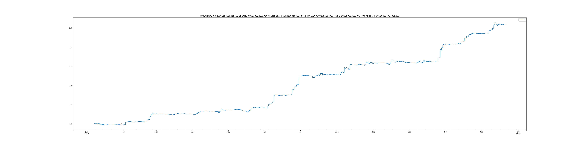
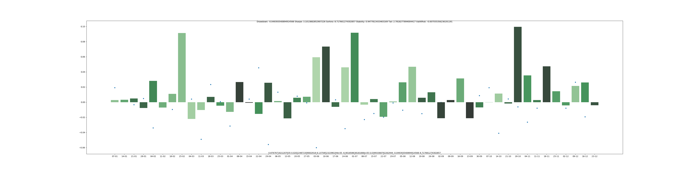

# FX Reinforcement Learning Playground
Beat me in my own game! Develop your RL agent with provided FX features environment.

This repository contains an open challenge for a Portfolio Balancing AI in Forex.

The state of the FX market is represented via 512 features in X_train and X_test.

Returns of each asset during training and test periods are in y_train and y_test.

example.py contains an implementation that hourly balances a long-short portfolio.

Up to 2x leverage is allowed. Your objective is to outperform following risk metrics.

# Test results that I have obtained myself:
Max. Drawdown: 2.56% 
Sortino Ratio: 13.65x

Sharpe Ratio: 3.99x 
Stability: 96.35% 

Tail Ratio: 2.99x 
Value at Risk: -0.52%

